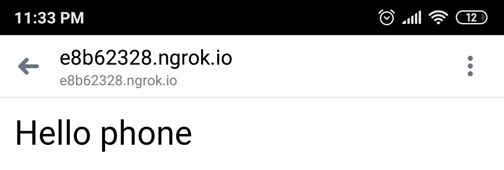

# Expressjs-and-ngRok
 Device detection library for node.js based on the user-agent, built on top of express 
 
# 1 we started a node module

>add the following command in the console to start a node module

`$ npm init -y`

a package.json is created

# 2 install the next module

`$ npm i express-device express `

this works with an express backend already created

# 3 Enter the code that appears in the script index file

# 4 Go to the ngRok website
Is a console tool or program
that runs the server from a local port and makes it public from a
Internet address and you can try it from your
mobile device.

# 5 Download the executable
Automatically will be detecting your operating system.

Uncompress the file after having unzipped the file you must save the executable in the project folder

# 6 Run the file in console
before you should check that you have running the server.

enter another new console window enter the following command along with the port you assigned in our case port 3000

`$ ./ngrok.exe http 3000 `

# 7 Enter the link from the mobile
you will get the following you must enter the following link from a mobile phone.

> As you can see, he has identified the mobile phone

enter the original documentation to see more details

https://github.com/rguerreiro/express-device
